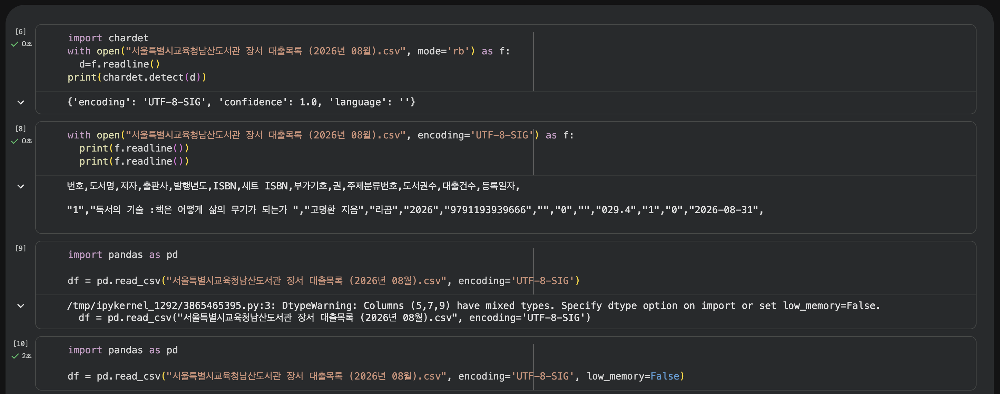
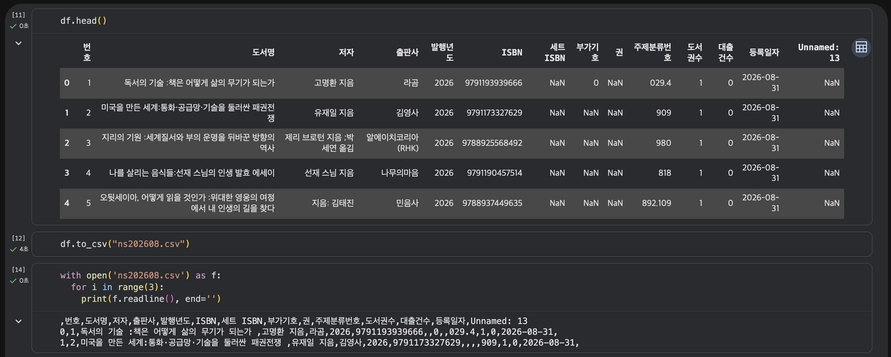
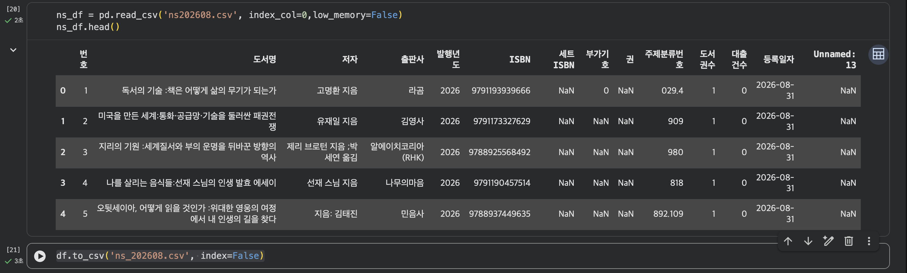

# 데이터분석 1주차 정규과제

📌데이터분석 정규과제는 매주 정해진 분량의 『*혼자 공부하는 데이터 분석 with 파이썬*』 을 읽고 학습하는 것입니다. 이번 주는 아래의 **DataAnalysis_1st_TIL**에 나열된 분량을 읽고 공부하시면 됩니다.

아래의 문제를 풀어보며 학습 내용을 점검하세요. 문제를 해결하는 과정에서 개념을 스스로 정리하고, 필요한 경우 제시된 강의를 참고하여 보완하는 것이 좋습니다.

<!-- 강의 링크는 아래와 같습니다.
https://www.youtube.com/watch?v=qGE_rT_oQaQ&list=PLVsNizTWUw7FGzSRCkQrPEEe-ljVXgS7k
https://www.youtube.com/watch?v=tp9XmeaHU0E&list=PLVsNizTWUw7FGzSRCkQrPEEe-ljVXgS7k&index=2
https://www.youtube.com/watch?v=D46j-e_IHlI&list=PLVsNizTWUw7FGzSRCkQrPEEe-ljVXgS7k&index=3
-->


## DataAnalysis_1st_TIL

### 1장 데이터 분석을 시작하며
#### 01. 데이터 분석이란
#### 02. 구글 코랩과 주피터 노트북
#### 03. 이 도서가 얼마나 인기가 좋을까요?


## Study Schedule

| 주차  | 공부 범위     | 완료 여부 |
| ----- | ------------- | --------- |
| 1주차 | p.24~81    | ✅         |
| 2주차 | p.84~151   | 🍽️         |
| 3주차 | p.154~219  | 🍽️         |
| 4주차 | p.222~279 | 🍽️         |
| 5주차 | p.282~325 | 🍽️         |
| 6주차 | p.328~379 | 🍽️         |
| 7주차 | p.382~430 | 🍽️         |

<br>

<!-- 여기까진 그대로 둬 주세요-->


# 1️⃣ 개념 정리 

## 01. 데이터 분석이란

### 데이터 분석

> 유용한 정보를 발견하고 결론을 유추하거나, 의사 결정을 돕기 위해 데이터를 조사, 정제, 변환, 모델링하는 과정

- 비즈니스 결정을 과학적으로 내리기 위한 도구
- 올바른 결정을 돕기 위한 **통찰**을 제공

### 데이터 분석 vs 데이터 과학

| 특징 | 데이터 분석 | 데이터 과학 |
| --- | --- | --- |
| 범주 | 비교적 소규모 | 대규모 |
| 목표 | 의사 결정을 돕기 위한 통찰 제공 | 문제 해결을 위한 최선의 솔루션 개발 |
| 주요 기술 | 컴퓨터 과학, 통계학, 시각화 | 컴퓨터 과학, 통계학, 머신러닝, 인공지능 |
| 빅데이터 | 사용 | 사용 |

## 02. 구글 코랩과 주피터 노트북

| 특징 | 구글 코랩 | 주피터 노트북 |
| --- | --- | --- |
| 설치 | 클라우드 기반 → 설치 불필요 | 내 컴퓨터에 설치 |
| 실행 환경 | 인터넷이 연결된 웹 브라우저 | 오프라인 상태의 웹 브라우저 |
| 파일 저장 | 구글 드라이브에 자동 저장 | 내 컴퓨터 하드 디스크에 저장 |
| 패키지 | 사전 설치되어 제공 | 패키지 관리자로 직접 설치 |
## 03. 이 도서가 얼마나 인기가 좋을까요?

### 파이썬으로 CSV 파일 출력하기

### open() 함수 이용

```python
with open("서울특별시교육청남산도서관 장서 대출목록 (2026년 08월).csv") as f:
    print(f.readline())
```

- **UnicodeDecodeError** 발생
  - `open()` 함수 기본 인코딩: UTF-8
  - 한글 텍스트: EUC-KR

### 파일 인코딩 형식 확인하기

`chardet.detect()` 함수를 이용한다.

```python
import chardet

with open("서울특별시교육청남산도서관 장서 대출목록 (2026년 08월).csv", mode='rb') as f:
    d = f.readline()

print(chardet.detect(d))
```

- `open()` 함수의 `mode` 매개변수를 바이너리 읽기 모드 `rb`로 지정
- 문자 인코딩 형식에 관계없이 파일을 열 수 있다

### 인코딩 형식 지정하기

```python
with open("서울특별시교육청남산도서관 장서 대출목록 (2026년 08월).csv", encoding='EUC-KR') as f:
    print(f.readline())
    print(f.readline())
```

### 데이터프레임 다루기: 판다스

CSV 파일을 읽어 데이터프레임이라는 표 형식 데이터로 저장한다.

#### low_memory 매개변수

- 기본값(`True`): 메모리를 효율적으로 사용하기 위해 CSV 파일을 나누어 읽음
- `False`: 파일을 나누어 읽지 않고 한 번에 읽음

```python
df = pd.read_csv("서울특별시교육청남산도서관 장서 대출목록 (2026년 08월).csv",
                 encoding='UTF-8-SIG', low_memory=False)
```

#### index_col=0

인덱스가 이미 있을 경우 지정한다.

```python
ns_df = pd.read_csv('ns202608.csv', index_col=0, low_memory=False)
ns_df.head()
```

#### CSV로 저장하기

```python
df.to_csv('ns_202608.csv', index=False)
```

# 2️⃣ 수행 인증


<br>
<br>
<br>

# 3️⃣ 확인 문제

## 문제 1.

> **🧚Q. 데이터 분석의 개념을 넓은 의미와 좁은 의미로 나누어 설명하고, 두 개념의 차이점도 함께 정리해주세요.**


```
좁은 의미의 데이터 분석은 기술통계와 탐색적 데이터 분석, 가설검정 까지만을 포함한다. 하지만 넓은 의미의 데이터 분석은 데이터 수집과 처리, 정제, 모델링까지의 전 범위를 아우른다.
```


### 🎉 수고하셨습니다.