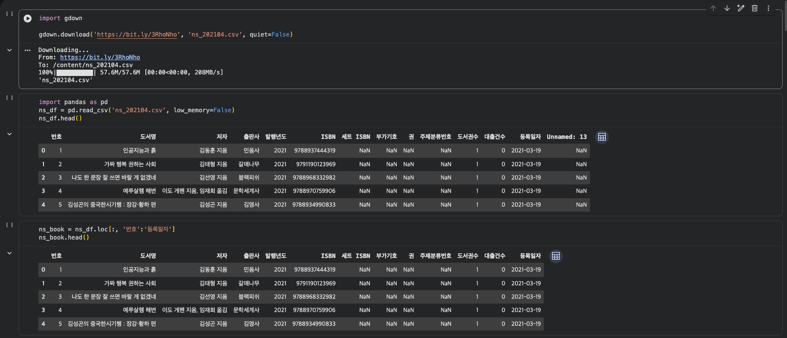
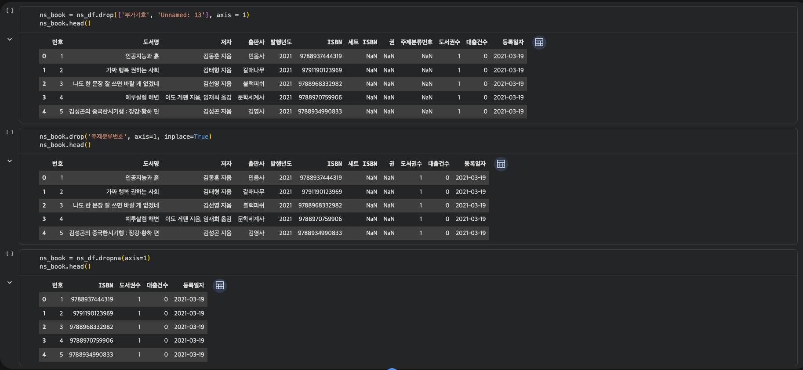
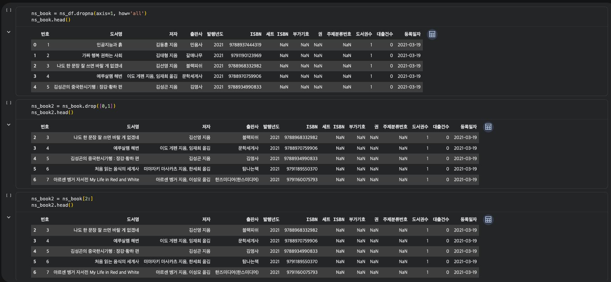
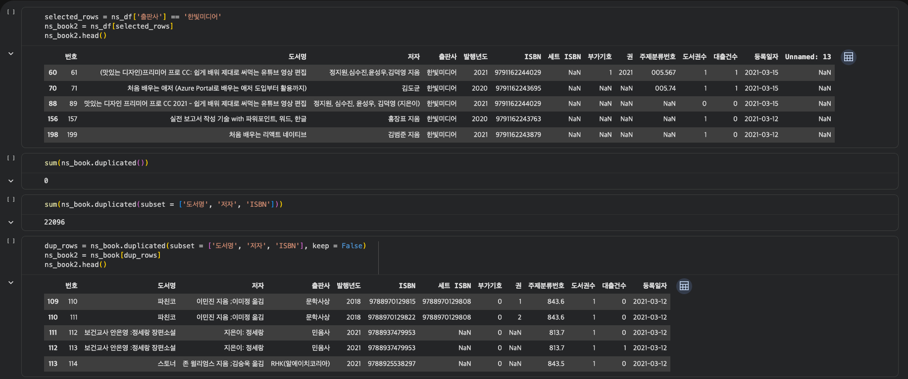
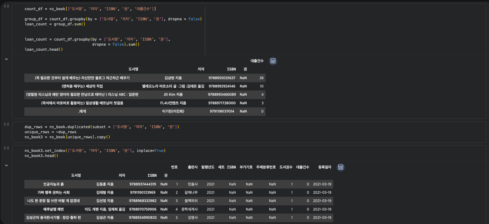
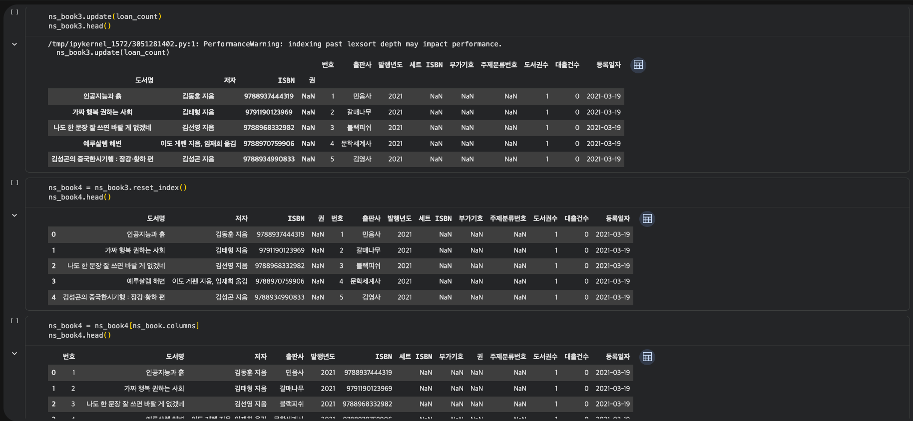
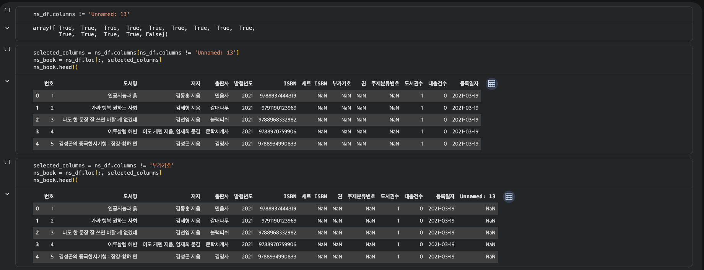

# 데이터분석 3주차 정규과제

📌데이터분석 정규과제는 매주 정해진 분량의 『*혼자 공부하는 데이터 분석 with 파이썬*』 을 읽고 학습하는 것입니다. 이번 주는 아래의 **DataAnalysis_3rd_TIL**에 나열된 분량을 읽고 공부하시면 됩니다.

아래의 문제를 풀어보며 학습 내용을 점검하세요. 문제를 해결하는 과정에서 개념을 스스로 정리하고, 필요한 경우 제시된 강의를 참고하여 보완하는 것이 좋습니다.

<!-- 강의 링크는 아래와 같습니다.
https://www.youtube.com/watch?v=CE3_InvbmLY&list=PLVsNizTWUw7FGzSRCkQrPEEe-ljVXgS7k&index=6
https://www.youtube.com/watch?v=hhbzUEQWdTg&list=PLVsNizTWUw7FGzSRCkQrPEEe-ljVXgS7k&index=7
-->


## DataAnalysis_3rd_TIL

### 3장 데이터 정제하기
#### 01. 불필요한 데이터 삭제하기
#### 02. 잘못된 데이터 수정하기


## Study Schedule

| 주차  | 공부 범위     | 완료 여부 |
| ----- | ------------- | --------- |
| 1주차 | p.24~81    | ✅         |
| 2주차 | p.84~151   | ✅         |
| 3주차 | p.154~219  | ✅         |
| 4주차 | p.222~279 | 🍽️         |
| 5주차 | p.282~325 | 🍽️         |
| 6주차 | p.328~379 | 🍽️         |
| 7주차 | p.382~430 | 🍽️         |

<br>

<!-- 여기까진 그대로 둬 주세요-->


# 1️⃣ 개념 정리 

## 불필요한 데이터 삭제하기

### 데이터 정제

> 데이터에서 손상되거나 부정확한 부분을 수정하고, 불필요한 데이터를 삭제하거나 불완전한 값을 교체하는 등의 작업

### 열 삭제하기

#### loc 메서드와 불리언 배열

```python
ns_book = ns_df.loc[:, '번호':'등록일자']
```

- `.columns`
  - Index 클래스 객체
  - 원소별 비교: 자동으로 배열에 있는 모든 원소와 하나씩 비교

```python
    ns_df.columns != 'Unnamed: 13'
```

```python
selected_columns = ns_df.columns != '부가기호'
ns_book = ns_df.loc[:, selected_columns]
ns_book.head()
```

#### drop() 메서드

> pandas에서 데이터프레임의 행이나 열을 삭제
> `drop('삭제하려는 열 이름', axis=1)`

```python
ns_book = ns_df.drop(['부가기호', 'Unnamed: 13'], axis=1)
```

- `inplace=True` 매개변수: 선택한 데이터프레임 바로 수정 가능

```python
  ns_book.drop('주제분류번호', axis=1, inplace=True)
```

#### dropna() 메서드

> NaN이 하나 이상 포함된 행이나 열을 삭제
> `dropna(axis=1)`

- `how='all'` 매개변수: 모든 값이 NaN인 열만 삭제

```python
  ns_book = ns_df.dropna(axis=1, how='all')
```

### 행 삭제하기

#### drop() 메서드

```python
ns_book2 = ns_book.drop([0, 1])
```

#### [ ] 연산자와 슬라이싱

#### [ ] 연산자와 불리언 배열

> 비교 연산자를 활용해 원하는 행은 True, 제외할 행은 False로 표시한 불리언 배열을 만들어 활용

```python
selected_rows = ns_df['출판사'] == '한빛미디어'
ns_book2 = ns_df[selected_rows]
```

### 중복된 행 찾기

#### duplicated() 메서드

> 중복된 행 중에서 처음 행을 제외한 나머지 행은 True로, 중복되지 않은 나머지 모든 행은 False로 표시한 불리언 배열을 반환

```python
sum(ns_book.duplicated())
```

- `sum`: 중복된 행의 개수
- 기본값은 모든 열을 기준으로 중복 판단
- `subset` 매개변수: 일부 열 기준 중복 행

```python
  sum(ns_book.duplicated(subset=['도서명', '저자', 'ISBN']))
```

- `keep=False` 매개변수: 중복된 모든 행을 `True`로 표시

```python
  dup_rows = ns_book.duplicated(subset=['도서명', '저자', 'ISBN'], keep=False)
  ns_book2 = ns_book[dup_rows]
```

### 그룹별로 모으기

#### groupby() 메서드

```python
loan_count = count_df.groupby(by=['도서명', '저자', 'ISBN', '권'],
                              dropna=False).sum()
loan_count.head()
```

### 원본 데이터 업데이트 하기

#### 업데이트 하기 전 과정

1. `duplicated()` 메서드로 중복된 행을 `True`로 표시한 불리언 배열 생성
2. 불리언 배열을 반전시켜서 중복되지 않은 고유한 행을 `True`로 표시
3. 불리언 배열을 사용해 원본 배열에서 고유한 행만 선택

```python
dup_rows = ns_book.duplicated(subset=['도서명', '저자', 'ISBN', '권'])
unique_rows = ~dup_rows
ns_book3 = ns_book[unique_rows].copy()
```

- `~`: 불리언 배열 반전

#### 원본 데이터프레임 인덱스 설정하기

```python
ns_book3.set_index(['도서명', '저자', 'ISBN', '권'], inplace=True)
```

#### 업데이트하기: update() 메서드

```python
ns_book3.update(loan_count)
```

### 일괄 처리 함수 만들기

```python
def data_cleaning(filename):
    """
    남산 도서관 장서 CSV 데이터 전처리 함수
    :param filename: CSV 파일 이름
    """
    # 파일을 데이터프레임으로 읽기
    ns_df = pd.read_csv(filename, low_memory=False)
    # NaN인 열 삭제
    ns_book = ns_df.dropna(axis=1, how='all')
    # 대출건수 합치기
    count_df = ns_book[['도서명', '저자', 'ISBN', '권', '대출건수']]
    loan_count = count_df.groupby(by=['도서명', '저자', 'ISBN', '권'],
                                  dropna=False).sum()
    # 원본 데이터프레임에서 중복행 제외하고 고유행 추출하여 복사
    dup_rows = ns_book.duplicated(subset=['도서명', '저자', 'ISBN', '권'])
    unique_rows = ~dup_rows
    ns_book3 = ns_book[unique_rows].copy()
    # 인덱스 설정
    ns_book3.set_index(['도서명', '저자', 'ISBN', '권'], inplace=True)
    # loan_count의 누적 대출건수 업데이트
    ns_book3.update(loan_count)
    # 인덱스 재설정
    ns_book4 = ns_book3.reset_index()
    # 원본 데이터프레임의 열 순서로 변경
    ns_book4 = ns_book4[ns_book.columns]
    return ns_book4
```

## 잘못된 데이터 수정하기

### 데이터프레임 정보 요약 확인하기

```python
ns_book4.info()
```

### 누락된 값 처리하기

#### 누락된 값 개수 확인하기: isna() 메서드

```python
ns_book4.isna().sum()
```

#### 누락된 값으로 표시하기

```python
ns_book4.loc[0, '도서권수'] = None
```

```python
ns_book4.loc[0, '부가기호'] = np.nan
```

#### 누락된 값 바꾸기 (1): loc, fillna() 메서드

```python
set_isbn_na_rows = ns_book4['세트 ISBN'].isna()
ns_book4.loc[set_isbn_na_rows, '세트 ISBN'] = ''
```

- `isna()`: 누락된 값을 불리언 배열로 반환

```python
ns_book4.fillna('없음').isna().sum()
```

#### 누락된 값 바꾸기 (2): replace() 메서드

1. 바꾸려는 값이 하나일 때: `replace(원래 값, 새로운 값)`
2. 바꾸려는 값이 여러 개일 때: `replace([원래 값1, 원래 값2], [새로운 값1, 새로운 값2])`
3. 열마다 다른 값으로 바꿀 때: `replace({열 이름: 원래 값}, 새로운 값)`

### 정규 표현식

> 문자열 패턴을 찾아서 대체하기 위한 규칙의 모음

#### 숫자 찾기: \d

```python
ns_book4.replace({'발행년도': {r'\d\d(\d\d)': r'\1'}}, regex=True)[100:102]
```

- `regex=True`: 정규식 사용
- `r`: 정규 표현식을 다른 문자열과 구분
- 정규 표현식이 반복될 때는 중괄호로 개수 지정

```python
  ns_book4.replace({'발행년도': {r'\d{2}(\d{2})': r'\1'}}, regex=True)[100:102]
```

#### 문자 찾기: 마침표(.)

> 어떤 문자에도 대응하는 정규 표현식 문자


# 2️⃣ 수행 인증









<br>
<br>

# 3️⃣ 확인 문제

## 문제 1.

> **🧚Q. 다음 두 데이터프레임 df1, df2를 합쳐서 데이터프레임 df3를 만들려고 합니다.**  
> 적절한 판다스 명령을 선택해주세요.

<table>
<tr>

<td>

### df1

| index | col1 | col2 |
|-------|------|------|
| 0     | x    | 5    |
| 1     | y    | 6    |
| 2     | z    | 7    |

</td>

<td>

### df2

| index | col3 | col4 |
|-------|------|------|
| 0     | x    | 50   |
| 1     | y    | 60   |
| 2     | w    | 70   |

</td>

<td align="center" valign="middle">

<h2> ➜ </h2>

</td>

<td>

### df3 (결과)

| index | col1 | col2 | col3 | col4 |
|-------|------|------|------|------|
| 0     | x    | 5.0  | x    | 50.0 |
| 1     | y    | 6.0  | y    | 60.0 |
| 2     | z    | 7.0  | NaN  | NaN  |
| 3     | NaN  | NaN  | w    | 70.0 |

</td>

</tr>
</table>

```
1️⃣ pd.merge(df1, df2)
2️⃣ pd.merge(df1, df2, how='left')
3️⃣ pd.merge(df1, df2, left_on='col1', right_on='col3', how='outer')
4️⃣ pd.merge(df1, df2, left_on='col1', right_on='col3', how='inner')
```

```
3️⃣ pd.merge(df1, df2, left_on='col1', right_on='col3', how='outer')

df1과 df2에 공통 열 이름이 없어 left_on='col1', right_on='col3'으로 결합 기준을 직접 지정해야 한다.
또한 df1에만 있는 z와 df2에만 있는 w가 모두 결과에 남고 반대쪽 값이 NaN으로 채워졌으므로,
양쪽 행을 모두 보존하는 how='outer'가 맞다.
```


### 🎉 수고하셨습니다.