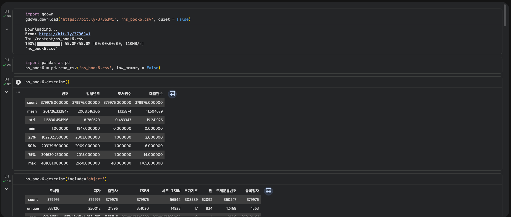
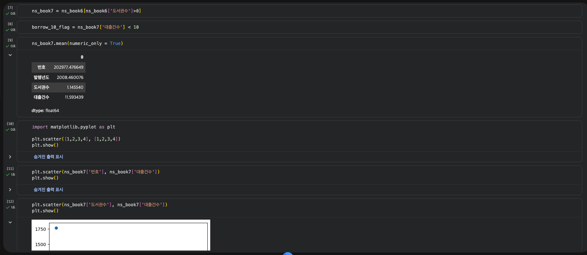
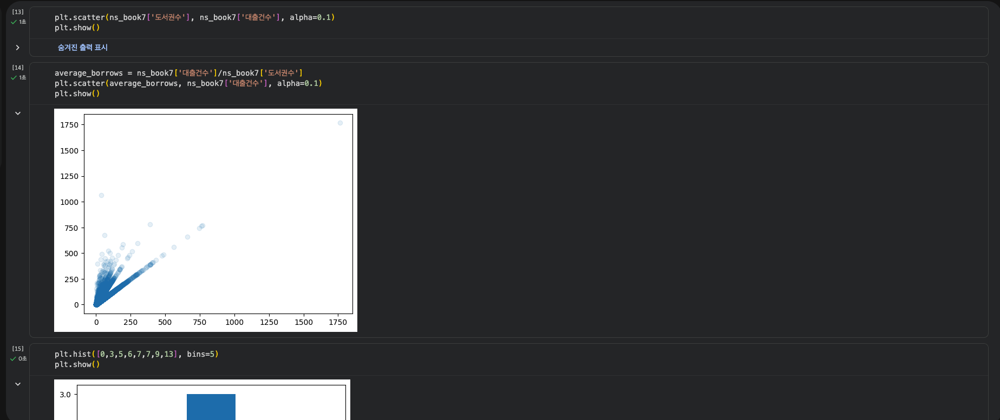
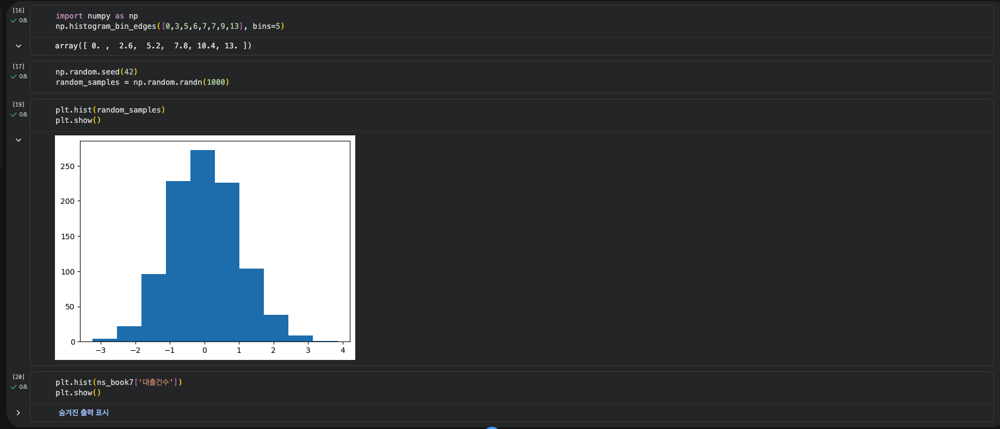
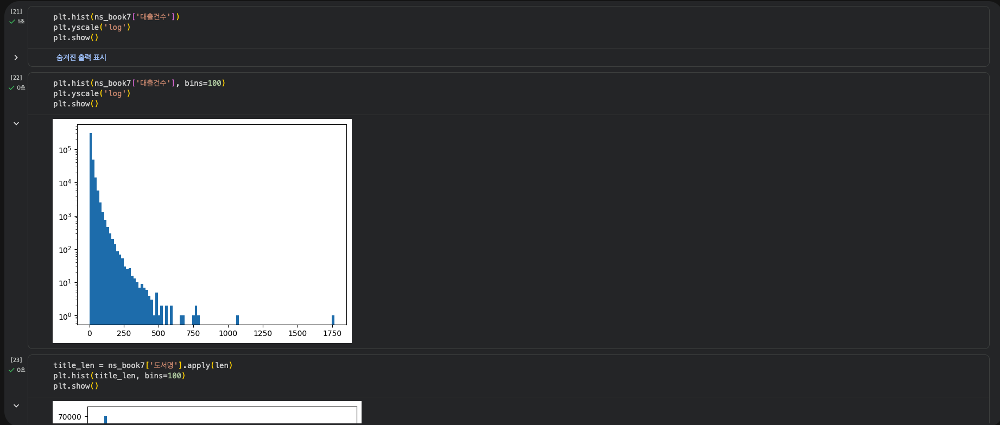
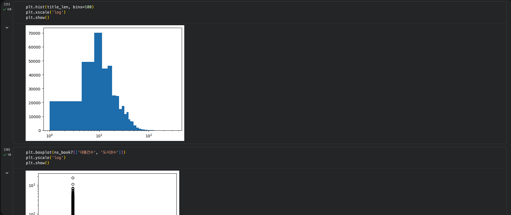
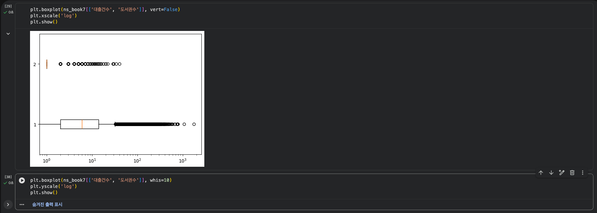

# 데이터분석 4주차 정규과제

📌데이터분석 정규과제는 매주 정해진 분량의 『*혼자 공부하는 데이터 분석 with 파이썬*』 을 읽고 학습하는 것입니다. 이번 주는 아래의 **DataAnalysis_4th_TIL**에 나열된 분량을 읽고 공부하시면 됩니다.

아래의 문제를 풀어보며 학습 내용을 점검하세요. 문제를 해결하는 과정에서 개념을 스스로 정리하고, 필요한 경우 제시된 강의를 참고하여 보완하는 것이 좋습니다.

<!-- 강의 링크는 아래와 같습니다.
https://www.youtube.com/watch?v=HNlRYQnLkek&list=PLVsNizTWUw7FGzSRCkQrPEEe-ljVXgS7k&index=8
https://www.youtube.com/watch?v=Cbk_tQtuhbM&list=PLVsNizTWUw7FGzSRCkQrPEEe-ljVXgS7k&index=9
-->


## DataAnalysis_4th_TIL

### 4장 데이터 요약하기
#### 01. 통계로 요약하기
#### 02. 분포 요약하기


## Study Schedule

| 주차  | 공부 범위     | 완료 여부 |
| ----- | ------------- | --------- |
| 1주차 | p.24~81    | ✅         |
| 2주차 | p.84~151   | ✅         |
| 3주차 | p.154~219  | ✅         |
| 4주차 | p.222~279 | ✅         |
| 5주차 | p.282~325 | 🍽️         |
| 6주차 | p.328~379 | 🍽️         |
| 7주차 | p.382~430 | 🍽️         |

<br>

<!-- 여기까진 그대로 둬 주세요-->


# 1️⃣ 개념 정리 

## 통계로 요약하기

### 기술통계 구하기

* `describe()`
  * count: 누락된 값을 제외한 데이터 개수
  * mean
  * std
  * min
  * 50%: 중앙값
  * 25%와 75%
  * max
  * `include` 매개변수 - 다른 데이터 타입의 열의 기술통계

### 평균 구하기

* `range()`
  * 하나의 숫자를 입력할 경우 0부터 입력된 숫자 직전까지 반복할 수 있는 객체 생성

### 중앙값 구하기

* `drop_duplicates()`
  * 중복된 값 가진 행 제거

### 분위수 구하기

* `quantile()`
  * 분위수 값 계산
  * `interpolation` 매개변수 - 보간: 두 지점 사이에 놓인 특정 위치의 값을 구하는 방법

### 백분위 구하기

* 불리언 배열

```python
borrow_10_flag = ns_book7['대출건수'] < 10
```

* 10보다 작은 대출 건수의 비율 구하기

### 데이터프레임에서 기술통계 구하기

* 수치형 열에서만 기술통계 구하기 가능
* `numeric_only = True`

```python
ns_book7.mean(numeric_only = True)
```

## 분포 요약하기

### 산점도 그리기

#### 산점도

두 변수 혹은 두 가지 특성 값을 직교 좌표계에 점으로 나타내는 그래프

* `matplotlib` 패키지 - 파이썬에서 그래프를 그릴 때 사용하는 패키지
* `scatter()` 함수

```python
plt.scatter(ns_book7['도서권수'], ns_book7['대출건수'])
plt.show()
```

* `alpha` 매개변수 - 0~1 사이의 값으로 투명도 지정

### 히스토그램 그리기

#### 히스토그램

수치형 특성의 값을 일정한 구간으로 나누어 구간 안에 포함된 데이터 개수를 막대 그래프로 그린 것
도수: 구간 안에 속한 데이터 개수

* `hist()` 함수

```python
plt.hist([0,3,5,6,7,7,9,13], bins=5)
```

* `randn()` 함수 - 표준정규분포를 따르는 랜덤한 실수를 생성
* `seed()` 함수 - 유사난수 생성 가능

#### 구간 조정하기

한 구간의 도수가 너무 커서 다른 구간의 도수가 표시되지 않는 현상이 발생하면, y축을 로그 스케일로 바꾸어 해결 가능

```python
plt.hist(ns_book7['대출건수'], bins=100)
plt.yscale('log')
plt.show()
```

### 상자 수염 그림 그리기

최솟값, 세 개의 사분위수, 최댓값을 사용해 데이터를 요약하는 그래프

* `boxplot()` 함수
  * `vert=False` - 수평으로 그리기
  * `whis` 매개변수 - 수염 길이 조정


# 2️⃣ 수행 인증










<br>
<br>

# 3️⃣ 확인 문제

## 문제 1.

> **🧚Q. 이번 주차에는 확인문제 대신 실습 과제를 진행합니다. 캐글에서 원하는 데이터셋을 선택하여 기술통계를 계산하고, 다양한 시각화를 수행해보세요.
작업은 코랩에서 진행한 뒤, 코랩 링크를 아래에 첨부해주세요.**

```
https://colab.research.google.com/drive/1Ae-W8wyHIdFOTuRzqpzjtb_2rx6zFm9e?usp=sharing
```


### 🎉 수고하셨습니다.