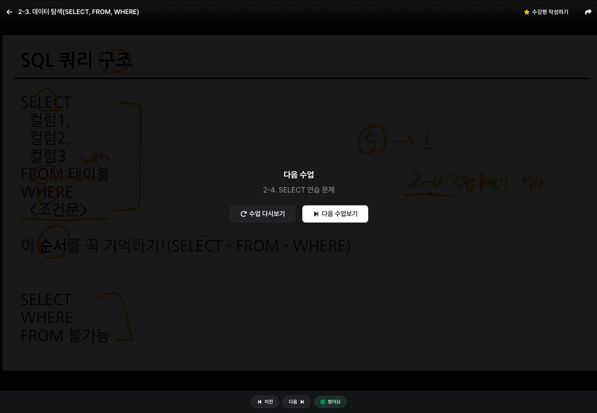
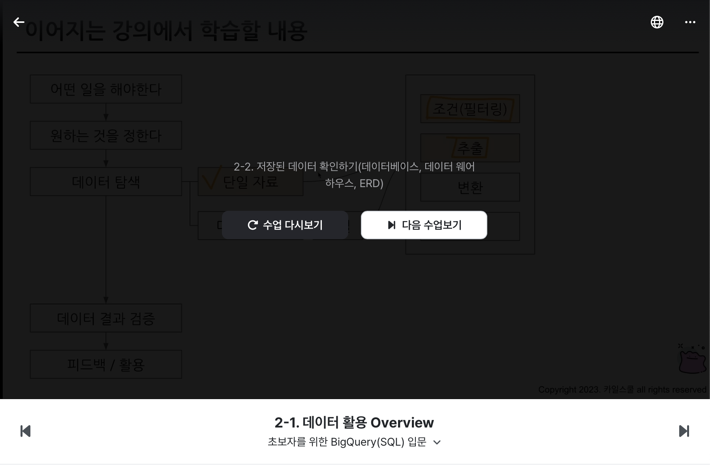
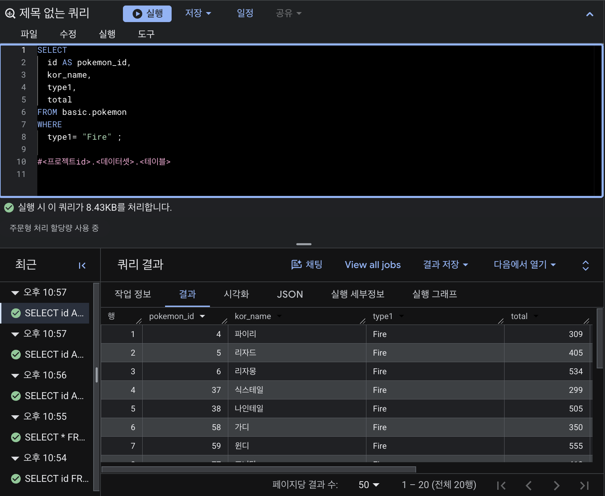
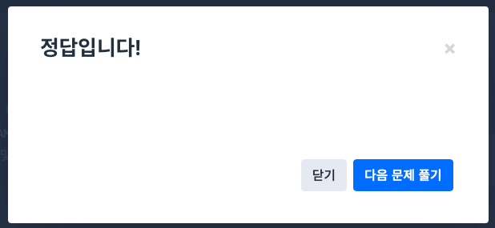
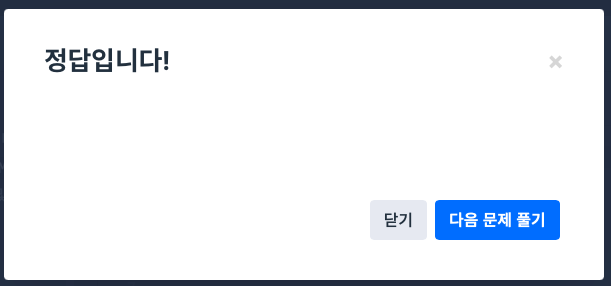

# 📘 SQL_BASIC 2주차 정규 과제

SQL_BASIC 정규 과제는 매주 정해진 분량의 `초보자를 위한 BigQuery(SQL) 입문` 강의를 듣고, 핵심 개념을 정리한 뒤 간단한 SQL 문제를 직접 풀어보는 방식으로 진행합니다.

이번 주는 저장된 데이터를 확인하는 방법과 `SELECT`, `FROM`, `WHERE`의 기본 구조를 학습합니다.

완성된 과제는 Github에 업로드하고, 링크를 스프레드시트 'SQL' 시트에 입력해 제출해주세요.

**👀 수행 인증란은 필수입니다.**

---

## 📚 SQL_BASIC_2nd_TIL

### 섹션 3. 데이터 탐색 - 조건, 추출, 요약

### 2-2. 저장된 데이터 확인하기(데이터베이스, 데이터 웨어하우스, ERD)

### 2-3. 데이터 탐색(SELECT, FROM, WHERE)

---

## ✨ 선택 강의

- 2-4. SELECT 연습 문제: SELECT, FROM, WHERE를 더 연습하고 싶을 때 선택 수강

---

## 🏁 전체 강의 수강 계획

| 주차 | 필수 강의 범위 | 선택 강의 | 완료 여부 |
| --- | --- | --- | --- |
| 1주차 | 1-1 ~ 2-1 | 1 | ✅ |
| 2주차 | 2-2 ~ 2-3 | 2-4 | ✅ |
| 3주차 | 2-5, 2-7 ~ 2-8 | 2-6 | 🍽️ |
| 4주차 | 3-2 ~ 4-3 | 3-4 | 🍽️ |
| 5주차 | 4-4 ~ 4-6 | 4-5, 4-7 | 🍽️ |
| 6주차 | 5-2 ~ 5-5 | 5-6 | 🍽️ |
| 7주차 | 필수 강의 없음 | 6-2, 6-3, 6-4, 6-5 | 🍽️ |

---

<br>

<!-- 여기까진 그대로 둬 주세요-->

---

# 1️⃣ 개념 정리

## SQL 쿼리를 작성하기 전

→ 데이터를 이해해야 함

### 데이터 웨어하우스

데이터를 추출하기 전에 데이터가 어떻게 저장되어 있는지 확인

#### 데이터 저장 형태

* **ERD**: 데이터베이스 구조 한 눈에 이해
    

* **ERD가 없다면?**
  * 직접 탐색 필요
  * 테이블, 컬럼, 연결, 값 등

* **데이터 예시**
  * 서비스 관련 데이터
    * 유저 테이블
    * 배송 테이블
    * 물건 테이블
  * 앱/웹 로그 데이터
    * 과정을 나타냄
  * 공공데이터

### SQL 쿼리 구조

* SELECT, FROM, WHERE

```sql
SELECT
	Col1 AS new_name,
	Col2,
	Col3
FROM Dataset.Table
WHERE
	Col1 = 1
```

### SQL 문법 핵심

| 항목 | 설명 |
|------|------|
| FROM | 데이터를 확인할 Table 명시<br>이름이 너무 길다면 AS "별칭" 사용 |
| WHERE | FROM에 명시된 Table에 저장된 데이터를 필터링(조건 설정)<br>Table에 있는 컬럼을 조건 설정 |
| SELECT | Table에 저장되어 있는 컬럼 선택<br>여러 컬럼 명시 가능<br>별칭 지정 가능 |

# 2️⃣ 수행 인증란

아래 중 하나 이상을 첨부해주세요.





---

# 3️⃣ 확인 문제

프로그래머스는 로그인이 필요하므로, 로그인 후 문제 풀이를 진행해주세요.

## 🧩 문제 1

문제 링크: [모든 레코드 조회하기](https://school.programmers.co.kr/learn/courses/30/lessons/59034)

풀이 과정:

```
- 테이블에서 확인한 컬럼: ANIMAL_ID, ANIMAL_TYPE, DATETIME, INTAKE_CONDITION, NAME, SEX_UPON_INTAKE
- SELECT와 FROM을 작성한 방식: 
    SELECT
        *
    FROM ANIMAL_INS
    ORDER BY ANIMAL_ID
- 새로 배운 점: 테이블에서 확인하고자 하는 컬럼과 레코드를 조회하는 방법을 배웠다.
```



## 🧩 문제 2

문제 링크: [아픈 동물 찾기](https://school.programmers.co.kr/learn/courses/30/lessons/59036)

풀이 과정:

```
- 문제에서 요구한 조건: 조회할 컬럼은 ANIMAL_ID와 DATETIME, 조회 순서는 ANIMAL_ID의 역순
- WHERE 절로 옮긴 방식: 조건이 따로 없어서 사용하지는 않음
- 정렬 기준이 있다면 사용한 기준: ANIMAL_ID DESC
- 새로 배운 점: ORDER BY에서 역순을 보여주는 방법을 배웠다.
```



---

# 4️⃣ 이번 주 회고

```
1. SELECT, FROM, WHERE 중 가장 헷갈린 개념: SELECT
2. 문제를 풀 때 가장 자주 확인하게 된 부분: SELECT에서 컬럼명
3. 다음 주 문제 풀이에서 의식하고 싶은 습관: 문제 꼼꼼히 읽기
```

수고하셨습니다!


