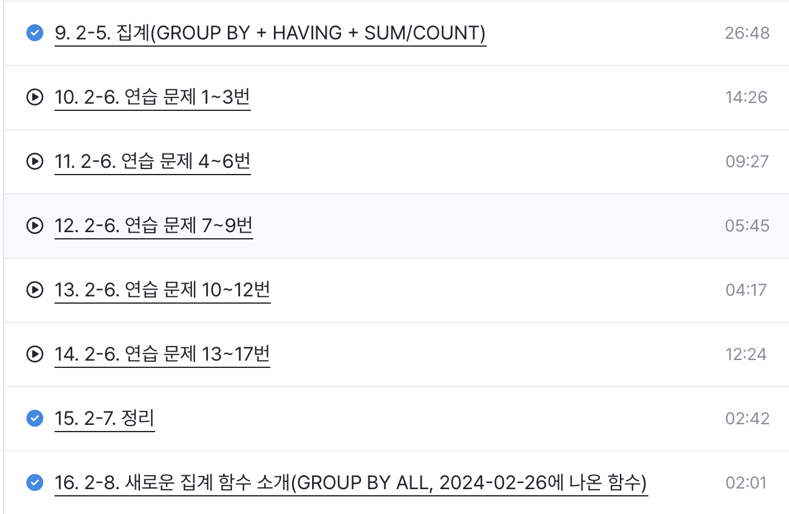
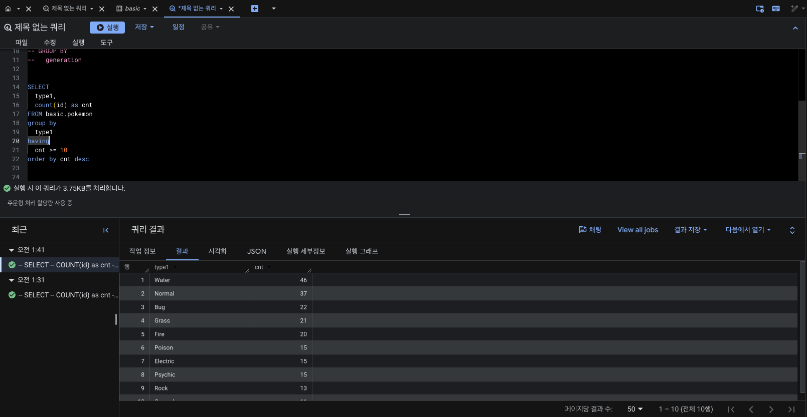

# 📘 SQL_BASIC 3주차 정규 과제

SQL_BASIC 정규 과제는 매주 정해진 분량의 `초보자를 위한 BigQuery(SQL) 입문` 강의를 듣고, 핵심 개념을 정리한 뒤 간단한 SQL 문제를 직접 풀어보는 방식으로 진행합니다.

이번 주는 집계 함수와 `GROUP BY`, `HAVING`을 학습합니다.

완성된 과제는 Github에 업로드하고, 링크를 스프레드시트 'SQL' 시트에 입력해 제출해주세요.

**👀 수행 인증란은 필수입니다.**

---

## 📚 SQL_BASIC_3rd_TIL

### 섹션 3. 데이터 탐색 - 조건, 추출, 요약

### 2-5. 집계(GROUP BY + HAVING + SUM/COUNT)

### 2-7. 정리

### 2-8. 새로운 집계 함수 소개(GROUP BY ALL, 2024-02-26에 나온 함수)

---

## ✨ 선택 강의

- 2-6. 연습 문제: 집계와 조건 조회를 더 연습하고 싶을 때 선택 수강

---

## 🏁 전체 강의 수강 계획

| 주차 | 필수 강의 범위 | 선택 강의 | 완료 여부 |
| --- | --- | --- | --- |
| 1주차 | 1-1 ~ 2-1 | 1 | ✅ |
| 2주차 | 2-2 ~ 2-3 | 2-4 | ✅ |
| 3주차 | 2-5, 2-7 ~ 2-8 | 2-6 | ✅ |
| 4주차 | 3-2 ~ 4-3 | 3-4 | 🍽️ |
| 5주차 | 4-4 ~ 4-6 | 4-5, 4-7 | 🍽️ |
| 6주차 | 5-2 ~ 5-5 | 5-6 | 🍽️ |
| 7주차 | 필수 강의 없음 | 6-2, 6-3, 6-4, 6-5 | 🍽️ |

---

<br>

<!-- 여기까진 그대로 둬 주세요-->

---

# 1️⃣ 개념 정리

## 집계 (Aggregation)

> 그룹화해서 계산하다

### GROUP BY

> 같은 값끼리 모아서 그룹화한다

- 특정 컬럼을 기준으로 모으면서 다른 컬럼에선 집계 가능
- 정렬, 조건 설정 가능

```sql
SELECT
    집계할_컬럼1,
    집계함수(컬럼2) AS 별칭
FROM 테이블
GROUP BY
    집계할_컬럼1
```

> 💡 집계할 컬럼을 `SELECT`에 명시했다면 그 컬럼을 꼭 `GROUP BY`에도 작성한다.

#### 집계함수

| 함수 | 설명 |
| --- | --- |
| `AVG` | 평균 |
| `COUNT` | row 세기 |
| `COUNTIF` | 특정 조건을 만족하는 row 세기 |
| `MAX` | 최댓값 |
| `MIN` | 최솟값 |
| `SUM` | 합계 |

> 💡 **GROUP BY ALL**
> `SELECT`에 있는 비집계 컬럼 전체를 자동으로 그룹화 기준으로 잡아준다. (BigQuery, DuckDB 등에서 지원)

#### DISTINCT

> 여러 값 중에 Unique 한 것만 보고 싶은 경우 사용

- 중복을 제거하는 것

```sql
SELECT
    집계할_컬럼,
    COUNT(DISTINCT count할_컬럼)
FROM 테이블
GROUP BY
    집계할_컬럼
```

### 조건 설정

#### WHERE

> 테이블에 바로 조건을 설정하고 싶은 경우 사용

- 그룹화 **이전**, 원본 row 단위로 조건 설정

```sql
SELECT
    컬럼1,
    컬럼2,
    COUNT(컬럼1) AS col1_count
FROM 테이블
WHERE
    컬럼1 >= 3
GROUP BY
    컬럼1, 컬럼2
```

#### HAVING

> `GROUP BY` 한 후 조건을 설정하고 싶은 경우 사용

- 그룹화 **이후**, 집계 결과에 조건 설정

```sql
SELECT
    컬럼1,
    컬럼2,
    COUNT(컬럼1) AS col1_count
FROM 테이블
GROUP BY
    컬럼1, 컬럼2
HAVING
    COUNT(컬럼1) > 3
```

### 서브 쿼리

- `SELECT` 문 안에 존재하는 `SELECT` 쿼리
- `FROM` 절에 또 다른 `SELECT` 문을 넣을 수 있음
- 괄호로 묶어서 사용

```sql
SELECT
    컬럼1,
    AVG(col1_count) AS avg_count
FROM (
    SELECT
        컬럼1,
        컬럼2,
        COUNT(*) AS col1_count
    FROM 테이블
    GROUP BY 컬럼1, 컬럼2
)
GROUP BY 컬럼1
```

### 정렬하기: ORDER BY

```sql
SELECT
    컬럼
FROM 테이블
ORDER BY 컬럼 [ASC | DESC]
```

- `ASC`: 오름차순 → Default
- `DESC`: 내림차순

### 출력 개수 제한하기: LIMIT

> 쿼리문의 결과 row 수를 제한하고 싶은 경우 사용

```sql
SELECT
    컬럼
FROM 테이블
LIMIT 10
```

---

# 2️⃣ 수행 인증란

아래 중 하나 이상을 첨부해주세요.



---

# 3️⃣ 확인 문제

프로그래머스는 로그인이 필요하므로, 로그인 후 문제 풀이를 진행해주세요.

## 🧩 문제 1

문제 링크: [최댓값 구하기](https://school.programmers.co.kr/learn/courses/30/lessons/59415)

풀이 과정:

```
- 문제 요구사항:
- 사용한 SQL 절:
- 새로 배운 점:
```

<!-- 정답을 맞추게 되면, 정답입니다. 이 부분을 캡처해서 이 주석을 지우시고 첨부해주시면 됩니다. -->

## 🧩 문제 2

문제 링크: [가장 비싼 상품 구하기](https://school.programmers.co.kr/learn/courses/30/lessons/131697)

풀이 과정:

```
- 사용한 집계 함수: MAX() — 값들 중 최댓값 하나를 반환하는 함수
- 집계 대상 컬럼: DATETIME — 보호 시작일시를 담은 DATETIME 타입 컬럼이라 값이 클수록 최근 입소
- 결과를 검증한 방법: 예시 데이터 4행 중 가장 늦은 2013-11-18 17:03:00(Anna)이 단일 행으로 출력되는지 확인
```


## 🧩 문제 3

문제 링크: [고양이와 개는 몇 마리 있을까](https://school.programmers.co.kr/learn/courses/30/lessons/59040)

풀이 과정:

```
- 그룹화 기준: ANIMAL_TYPE — 생물 종별로 마리 수를 세야 하므로 종을 기준으로 묶음
- WHERE와 HAVING 중 사용한 절: 둘 다 사용하지 않음 — 특정 종만 걸러내거나 집계 결과에 조건을 걸 필요가 없는 문제였음
- 처음 틀렸다면 틀린 이유: 집계 자체는 맞았으나 ORDER BY를 빠뜨려 "고양이를 개보다 먼저"라는 정렬 조건을 충족하지 못함
- 새로 배운 SQL 패턴: GROUP BY로 집계한 뒤 ORDER BY로 그룹 출력 순서를 지정하는 패턴 (ORDER BY ANIMAL_TYPE의 알파벳 오름차순으로 Cat이 Dog보다 먼저 나옴)
```


---

# 4️⃣ 이번 주 회고

```
1. 문제를 SQL로 옮길 때 가장 어려웠던 부분: 조건을 어느 절에 써야 하는지 판단하는 것. "가장 최근에 들어온 동물"을 WHERE max(DATETIME)처럼 자연어 순서대로 옮기려다 틀렸고, SQL은 FROM → WHERE → GROUP BY → HAVING → SELECT → ORDER BY 순으로 실행되기 때문에 각 조건이 어느 시점에 평가되는지를 먼저 따져야 한다는 걸 알게 됨.

2. WHERE와 HAVING의 차이를 어떻게 이해했는지: WHERE는 그룹화 이전에 원본 행을 하나씩 걸러내는 절이고, HAVING은 그룹화가 끝난 뒤 집계 결과에 조건을 거는 절이다. 그래서 WHERE 단계에서는 아직 집계가 일어나지 않아 MAX()나 COUNT() 같은 집계함수를 쓸 수 없고, 전체 최댓값 같은 값이 필요하면 서브쿼리로 먼저 계산해서 넘겨야 한다.

3. 다음 주에 더 연습하고 싶은 문제 유형: HAVING으로 집계 결과에 조건을 거는 문제(예: 특정 횟수 이상 등장한 그룹만 조회)와 서브쿼리를 활용하는 문제. 이번 주에는 GROUP BY + ORDER BY 조합까지만 다뤄서 HAVING을 실제로 써볼 기회가 없었고, 서브쿼리는 개념만 정리하고 직접 작성해보지는 않았음.
```

수고하셨습니다!


