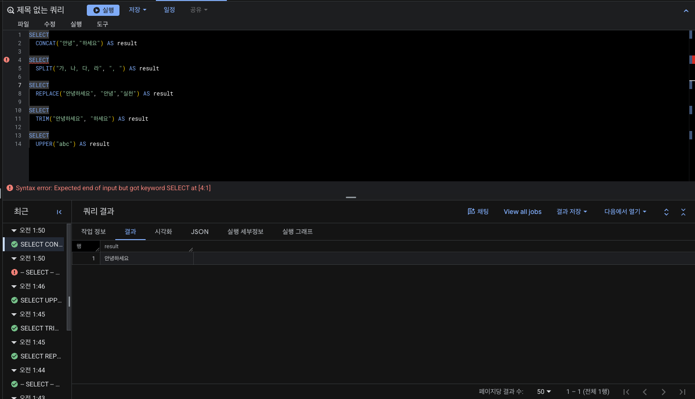
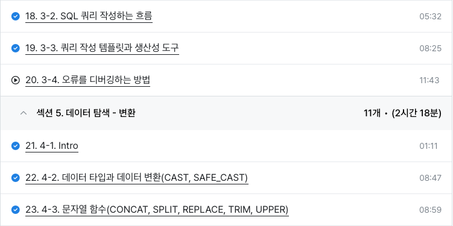

# 📘 SQL_BASIC 4주차 정규 과제

SQL_BASIC 정규 과제는 매주 정해진 분량의 `초보자를 위한 BigQuery(SQL) 입문` 강의를 듣고, 핵심 개념을 정리한 뒤 간단한 SQL 문제를 직접 풀어보는 방식으로 진행합니다.

이번 주는 SQL 쿼리를 작성하는 흐름, 쿼리 작성 템플릿, 데이터 타입 변환, 문자열 함수를 학습합니다.

완성된 과제는 Github에 업로드하고, 링크를 스프레드시트 'SQL' 시트에 입력해 제출해주세요.

**👀 수행 인증란은 필수입니다.**

---

## 📚 SQL_BASIC_4th_TIL

### 섹션 4. SQL 쿼리 잘 작성하기, 쿼리 작성 템플릿 및 오류를 잘 디버깅하기

### 3-2. SQL 쿼리를 작성하는 흐름

### 3-3. 쿼리 작성 템플릿과 생산성 도구

### 섹션 5. 데이터 탐색 - 변환

### 4-1. INTRO

### 4-2. 데이터 타입과 데이터 변환(CAST, SAFE_CAST)

### 4-3. 문자열 함수(CONCAT, SPLIT, REPLACE, TRIM, UPPER)

---

## ✨ 선택 강의

- 3-4. 오류를 디버깅하는 방법: 오류 메시지 해석과 디버깅 흐름을 더 익히고 싶을 때 선택 수강

---

## 🏁 전체 강의 수강 계획

| 주차 | 필수 강의 범위 | 선택 강의 | 완료 여부 |
| --- | --- | --- | --- |
| 1주차 | 1-1 ~ 2-1 | 1 | ✅ |
| 2주차 | 2-2 ~ 2-3 | 2-4 | ✅ |
| 3주차 | 2-5, 2-7 ~ 2-8 | 2-6 | ✅ |
| 4주차 | 3-2 ~ 4-3 | 3-4 | ✅ |
| 5주차 | 4-4 ~ 4-6 | 4-5, 4-7 | 🍽️ |
| 6주차 | 5-2 ~ 5-5 | 5-6 | 🍽️ |
| 7주차 | 필수 강의 없음 | 6-2, 6-3, 6-4, 6-5 | 🍽️ |

---

<br>

<!-- 여기까진 그대로 둬 주세요-->

---

# 1️⃣ 개념 정리

## 쿼리를 작성하는 흐름

1. 지표 고민 : 문제 정의
2. 지표 구체화 : 추상적이지 않고 구체적인 지표 명시
   * 분자와 분모 표시
   * 이름을 구체적으로
3. 지표 탐색 : 유사한 문제를 해결한 케이스 확인
   * 존재 → 해당 쿼리 리뷰
   * 구글에 검색
4. 쿼리 작성 : 테이블 ERD 찾기
   * 유사한 쿼리 없을 경우
   * 2개 이상 → 연결 방법 고민(JOIN)
   * 단계적으로 작성
5. 데이터 정합성 확인 : 예상한 결과와 동일한지 확인
6. 쿼리 가독성 : 나중을 위해 깔끔하게 쿼리 작성
7. 쿼리 저장 : 재사용되므로 문서로 저장

## 쿼리 작성 템플릿과 생산성 도구

### 쿼리 작성 템플릿

```sql
# 쿼리를 작성하는 목표, 확인할 지표 : 
# 쿼리 계산 방법 : 
# 데이터의 기간 : 
# 사용할 테이블 : 
# Join KEY : 
# 데이터 특징 : 

SELECT

FROM
WHERE
```

### 생산성 도구 : 템플릿 쉽게 사용하기

* Espanso
  * 특정 단어를 입력하면 원하는 문장(템플릿)으로 변경

## 데이터 탐색 : 변환

### 데이터 타입과 데이터 변환

#### 변환을 위한 함수

* SELECT 문에서 사용
  * WHERE 문도 가능

#### 데이터 타입

* 숫자
* 문자
* 시간, 날짜
* 부울(Bool)

#### 중요한 이유

→ **보이는 것과 저장된 것의 차이가 존재**

### 자료 타입 변경하기

→ `CAST`

```sql
SELECT
	CAST(1 AS STRING)
```

* 더 안전하게 변환하기
  * `SAFE_CAST`
* 수학 함수
  * 수학 연산이 존재
  * `SAFE_DIVDE`

### 문자열 함수

| 연산 | Input | Output | 함수 이름 |
|------|-------|--------|----------|
| 문자열 붙이기 | "안녕"+"하세요" | "안녕하세요" | CONCAT |
| 문자열 분리하기 | "가, 나, 다, 라" | "가", "나", "다", "라" | SPLIT |
| 특정 단어 수정하기 | "안녕하세요" | "실천하세요" | REPLACE |
| 문자열 자르기 | "안녕하세요" | "안녕" | TRIM |
| 영어 대문자 변환 | "ab" | "AB" | UPPER |

```sql
SELECT
  CONCAT("안녕","하세요") AS result
```

```sql
SELECT
  SPLIT("가, 나, 다, 라", ", ") AS result
```

```sql
SELECT
  REPLACE("안녕하세요", "안녕","실천") AS result
```

```sql
SELECT 
  TRIM("안녕하세요", "하세요") AS result
```

```sql
SELECT
  UPPER("abc") AS result
```

---

# 2️⃣ 수행 인증란

아래 중 하나 이상을 첨부해주세요.




---

# 3️⃣ 확인 문제

프로그래머스는 로그인이 필요하므로, 로그인 후 문제 풀이를 진행해주세요.

## 🧩 문제 1

문제 링크: [특정 옵션이 포함된 자동차 리스트 구하기](https://school.programmers.co.kr/learn/courses/30/lessons/157343)

풀이 과정:

```
- 찾으려는 문자열 조건: 옵션에 네비게이션이 포함된 자동차
- 사용한 문자열 조건 문법: `LIKE '%네비게이션%'` 또는 `= '네비게이션'`
- 정렬 기준: CAR_ID 내림차순(DESC)
```


## 🧩 문제 2

문제 링크: [강원도에 위치한 생산공장 목록 출력하기](https://school.programmers.co.kr/learn/courses/30/lessons/131112)

풀이 과정:

```
- 찾으려는 문자열 조건: 주소가 강원도로 시작하는 식품 공장
- 사용한 문자열 조건 문법: `LIKE '강원도%'`
- 정렬 기준: FACTORY_ID 오름차순(ASC)
```


## 🧩 문제 3

문제 링크: [이름에 el이 들어가는 동물 찾기](https://school.programmers.co.kr/learn/courses/30/lessons/59047)

풀이 과정:

```
- 찾으려는 조건: 이름에 'el'이 들어가면서 동물 종류가 개(Dog)
- 사용한 문자열 조건 문법: `LIKE '%el%'` (대소문자 구분 안 함), `ANIMAL_TYPE = 'Dog'`
- 정렬 기준: NAME 오름차순, 같으면 ANIMAL_ID 오름차순
```


## 🧩 문제 4

문제 링크: [카테고리 별 상품 개수 구하기](https://school.programmers.co.kr/learn/courses/30/lessons/131529)

풀이 과정:

```
- 추출한 문자열 범위: PRODUCT_CODE 앞 2자리
- 그룹화 기준: LEFT(PRODUCT_CODE, 2) (카테고리 코드별)
- 정렬 기준: CATEGORY 오름차순(ASC)
```


---

# 4️⃣ 이번 주 회고

```
1. 쿼리 작성 흐름을 잡을 때 도움이 된 방법:
   풀이 과정 템플릿(추출 범위, 그룹화 기준, 정렬 기준)을 먼저 정리한 후 쿼리 작성. SELECT → FROM → WHERE → GROUP BY → ORDER BY 순서로 단계적 진행

2. 타입 변환이나 문자열 처리에서 조심해야 할 점:
   LIKE에서 '%' 위치 확인, IN vs = 구분, LEFT/SUBSTRING 자리수 정확히 확인, SELECT 절에서 쉼표 빠지지 않도록 주의

3. 앞으로 문제 풀이 때 먼저 확인할 것:
   요구 조건 재확인(필터링 조건 누락 없나?), SELECT 절 쉼표 확인, 정렬 기준이 문제 요구대로 설정되었나 확인
```

수고하셨습니다!


